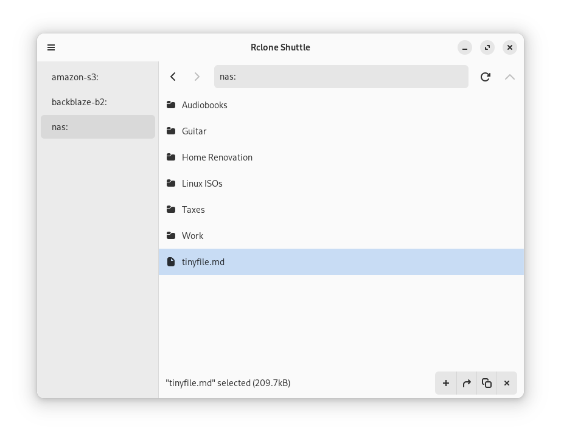

 

GTK4 frontend for Rclone to upload files to [any supported](https://rclone.org/overview/) cloud storage provider or storage protocol.

Rclone Shuttle can:

- Upload files via drag and drop
- Rename, move, copy and delete files/folders
- Open remote files locally via double click
- Handle encrypted Rclone configuration files

Some of Rclone's supported cloud storage providers and protocols:

- Amazon S3 and API-compatible derivatives
- Dropbox
- FTP
- Google Cloud Storage
- Google Drive
- Google Photos
- OneDrive
- Proton Drive
- SFTP
- SMB (Samba)
- WebDAV (works with Nextcloud)

## Install

### Linux
We'd like to cover a variety of distros and architectures with one distribution mechanism, so we're submitting to Flathub. For now, there's an x86_64 RPM.

### Building from source
Since Rclone Shuttle is written in Rust, you can generate a release build for your architecture and OS by checking out the repo and running `cargo build --release`. You will need [GTK's development kit](https://gtk-rs.org/gtk4-rs/stable/latest/book/installation.html) and Rclone v1.65 or up.